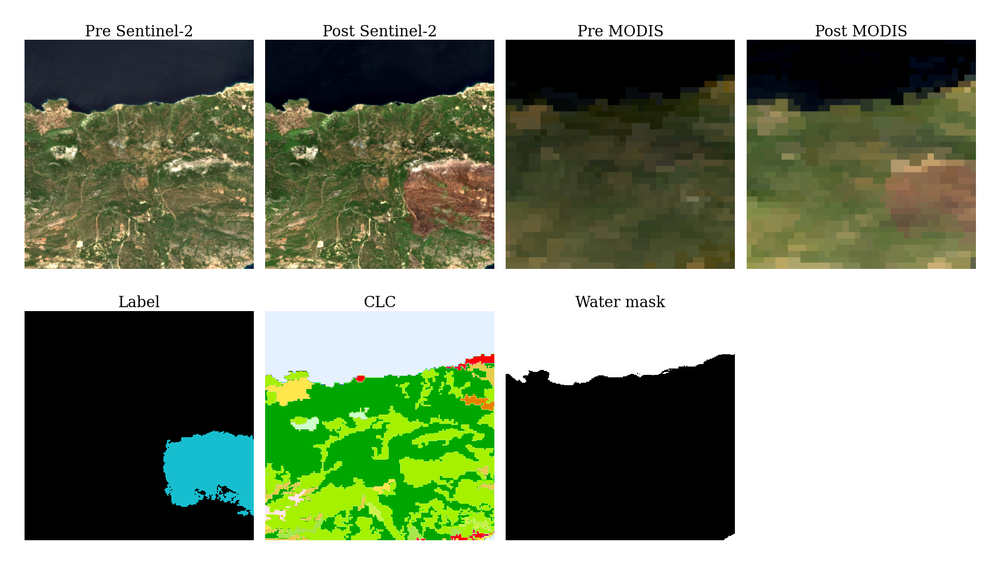
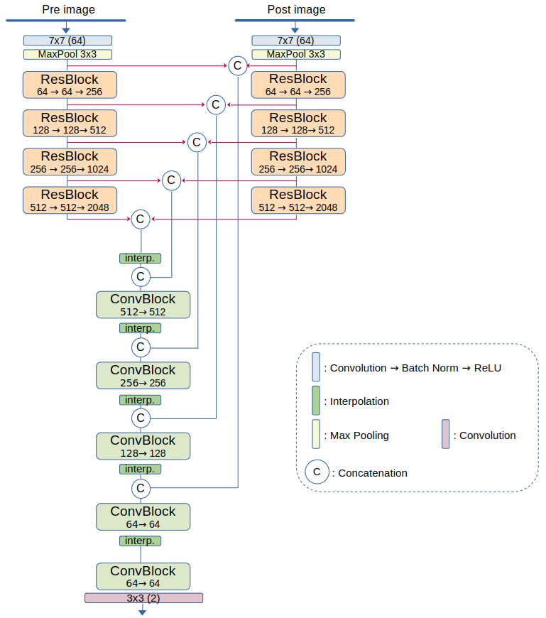

## FLOGA and BAM-CD

This repository contains the dataset and code for the paper **"FLOGA: A machine learning ready dataset, a benchmark and a novel deep learning model for burnt area mapping with Sentinel-2"** (Sdraka et al., 2023).

## FLOGA Dataset



You can download the FLOGA dataset from [Dropbox](https://www.dropbox.com/scl/fo/3sqbs3tioox7s5vb4jmwl/h?rlkey=5p3e7wa5al4cy9x34pmtp9g6d&dl=0).

In order to read the downloaded .hdf files, the `hdf5plugin`  python module is needed because data have been compressed using BZip2. These files include the raw Sentinel-2 and MODIS imagery aligned to a common grid, along with the labels and the various masks.

#### Set up
After downloading the .hdf files, you can create an analysis-ready dataset with the `create_dataset.py` script. This python script reads the .hdf files, crops the images into smaller patches and then performs a train/val/test split on the patches.

For example,

```
python create_dataset.py --floga_path path/to/hdf/files --out_path data/ --out_size 256 256 --sample 1
```

The above command will crop the images into 256x256 patches and export 3 pickle files with the train, validation and test splits respectively. The option `--sample` dictates that for each positive patch (i.e. patch that contains at least 1 burnt pixel) a negative one (i.e. a patch with no burnt pixels) will be included. Run `python create_dataset.py --help` for more information on the various options.

#### Brief description

FLOGA contains aligned Sentinel-2 and MODIS imagery for 326 wildfire events in Greece over the period 2017-2021, along with high-resolution burnt area mappings produced by the Hellenic Fire Service. For each event, the dataset offers:
 - Pre-fire Sentinel-2/MODIS imagery
 - Post-fire Sentinel-2/MODIS imagery
 - Cloud masks for the pre-fire imagery
 - Cloud masks for the post-fire imagery
 - Water mask
 - Corine Land Cover mask
 - Ground truth label

The labels can contain the following values: **0** for non-burnt pixels, **1** for burnt pixels, and **2** for pixels burnt in other fire events of the same year. The pixels marked with **2** may or may not contain burnt areas (this depends on the timestamps of the fires as well as the timestamps of the selected satellite imagery), so we have marked them with this unique value in order to facilitate their exclusion from the training/evaluation process.

#### Dataset exploration
A useful notebook with an exploration of the dataset can be found in `Data_exploration.ipynb`.

#### Benchmark data splits
The train/val/test splits used in the paper can be found [here](https://www.dropbox.com/scl/fi/vq3tl8w5ex23lt1k7z89e/data_split.csv?rlkey=v3ph1xvfykhiljkg6rzlsytq2&dl=0). A ratio of 1:1 was selected (1 negative patch for each positive patch) and sea and cloud patches were removed.

## BAM-CD



This repo also contains the code for the proposed BAM-CD model for burnt area mapping with bitemporal Sentinel-2 imagery. The model can be found inside the folder `models/bam_cd/`. The implementation is heavily based on [segmentation_models.pytorch](https://github.com/qubvel/segmentation_models.pytorch).

#### Pretrained model

You can find the weights of the pretrained BAM-CD model [here](https://www.dropbox.com/scl/fo/9fia0j00h539t9x6gvc9z/h?rlkey=rvl5bsmx1au796x5z76jkmmgb&dl=0).

## UPDATES

 - **9/4/2024:** An issue with MODIS imagery on the 2019 data has been fixed.

## Citation
If you would like to use our work, please cite our paper:

```
@ARTICLE{10479972,
  author={Sdraka, Maria and Dimakos, Alkinoos and Malounis, Alexandros and Ntasiou, Zisoula and Karantzalos, Konstantinos and Michail, Dimitrios and Papoutsis, Ioannis},
  journal={IEEE Journal of Selected Topics in Applied Earth Observations and Remote Sensing}, 
  title={FLOGA: A Machine-Learning-Ready Dataset, a Benchmark, and a Novel Deep Learning Model for Burnt Area Mapping With Sentinel-2}, 
  year={2024},
  volume={17},
  number={},
  pages={7801-7824},
  doi={10.1109/JSTARS.2024.3381737}
}
```
